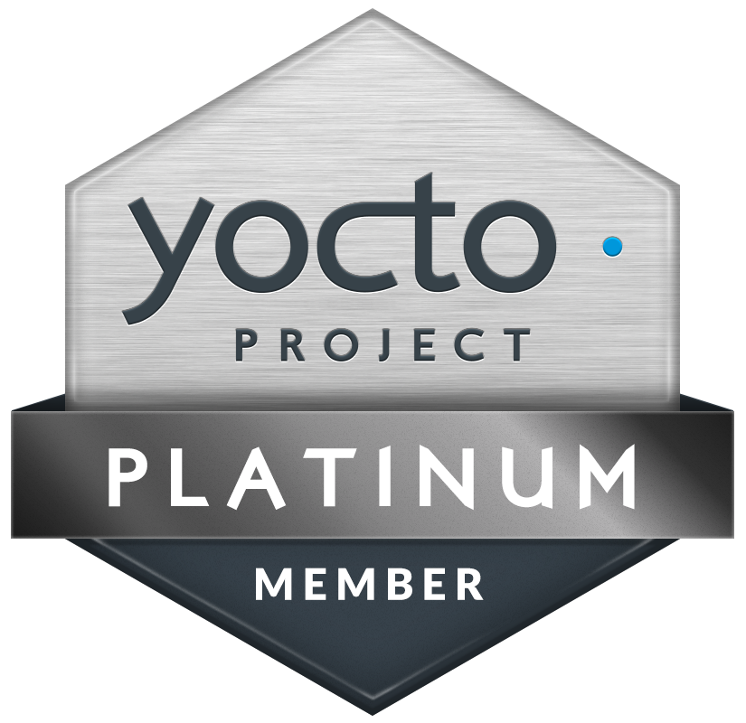
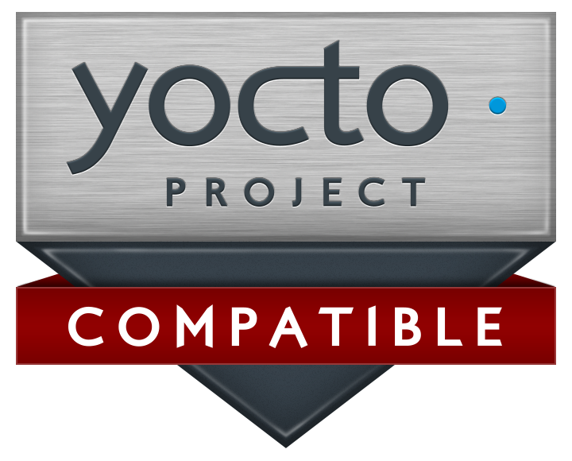

# the meta-aws project
<table border="0" rules="none">
<tr border="0">
<td width="150" height="150"></td>
<td width="150" height="150"></td>
</tr>
</table>

The **meta-aws project** provides *recipes* for building in AWS edge software capabilities to [Embedded Linux](https://elinux.org) built with [OpenEmbedded](https://www.openembedded.org) and [Yocto Project](https://www.yoctoproject.org/) build frameworks.

Please check out [our sister project meta-aws-demos](https://github.com/aws-samples/meta-aws-demos)!  Over time, we will continuously be adding MACHINE specific demonstrations for AWS software on Embedded Linux built by the Yocto Project build framework with the meta-aws Metadata Layer.

### Supported Yocto Project Releases

We are supporting customers building solutions on AWS with meta-aws. Let us know if you need AWS device software for a specific Yocto Project release and we will work with you through Github Issues to resolve the challenge you might be facing.  We also encourage [contributions](CONTRIBUTING.md) by the community.
We are yocto project compatible<a href="https://www.yoctoproject.org/software-overview/layers/?searchTerm=meta-aws" target="none" title="What is this?">(?)</a>.
Currently maintained releases are all [NOT-EOL ones](https://wiki.yoctoproject.org/wiki/Releases). All prior releases will be handled on a case by case basis. Again, please let us know if you're in a crunch on earlier releases and we'll help you the best we can!

### CVE checks
We do nightly CVE checks on the master branch for every recipe in our layer. You can see those check results here:

### Dependencies

**meta-aws** supports a wide variety of device software.  This layer defines a minimum dependency set that covers many of the recipes.  Sometimes, the recipe will require additional layers either to support optional features or programming languages not supported by OpenEmbedded. When those requirements surface, they are documented in recipe specific README files.

Base dependencies:

* core
* openembedded-layer (meta-oe)
* multimedia-layer (meta-multimedia)
* networking-layer (meta-networking)
* meta-python

Dynamic additional dependencies:

* virtualization-layer (meta-virtualization) for the [EC2 AMI creation feature](scripts/ec2-ami/README.md)

### Supported recipes for services, software, and SDKs

These are the currently supported services, software, and SDKs you can use to build AWS solutions with many types of devices when building your distribution with the Yocto Project.

|Service, Software, or SDK |Details |
|:------------------------:|:-------|
|
 AWS IoT FleetWise
|AWS IoT FleetWise is a service that makes it easy for Automotive OEMs, Fleet Operators, Independent Software Vendors (ISVs) to collect, store, organize, and monitor data from vehicles at scale. See details here: [Reference Implementation for AWS IoT FleetWise](https://github.com/aws/aws-iot-fleetwise-edge).|
|
 Amazon EC2
|Allow to create EC2 AMI images and upload them with Yocto - x86-64 and arm64. See details here: [EC2 AMI creation feature](scripts/ec2-ami/README.md).|
|
 Amazon CloudWatch Publisher
|Installs and configures the [Amazon CloudWatch Publisher](https://github.com/awslabs/amazon-cloudwatch-publisher). Amazon CloudWatch provides a wealth of tools for monitoring resources and applications in real-time. However, out-of-the-box support is limited to AWS-native resources (e.g. EC2 instances) or systems compatible with the CloudWatch Agent.|
| AWS Command Line Interface v1|The AWS Command Line Interface (CLI) is a unified tool to manage your AWS services. With just one tool to download and configure, you can control multiple AWS services from the command line and automate them through scripts.|
|
 Amazon Corretto
|Amazon Corretto is a no-cost, multiplatform, production-ready distribution of the Open Java Development Kit (OpenJDK). Corretto comes with long-term support that will include performance enhancements and security fixes. Amazon runs Corretto internally on thousands of production services and Corretto is certified as compatible with the Java SE standard.|
|
 AWS IoT Device Client
|The AWS IoT Device Client is free, open-source, modular software written in C++ that you can compile and install on your Embedded Linux based IoT devices to access AWS IoT Core, AWS IoT Device Management, and AWS IoT Device Defender features by default.|
|
 AWS IoT Greengrass v2.0
|AWS IoT Greengrass is an Internet of Things (IoT) open source edge runtime and cloud service that helps you build, deploy, and manage device software. Customers use AWS IoT Greengrass for their IoT applications on millions of devices in homes, factories, vehicles, and businesses. You can program your devices to act locally on the data they generate, execute predictions based on machine learning models, filter and aggregate device data, and only transmit necessary information to the cloud. <a href="recipes-iot/aws-iot-greengrass/README.md#aws-iot-greengrass-v2">README</a>|
|
 AWS SDK for Python
|The AWS SDK for Python provides the python libraries you can use to interact with AWS Cloud. Botocore and Boto3 are available.|
|
 AWS IoT Device SDK for C++ v2|The AWS IoT C++ Device SDK allows developers to build connected applications using AWS and the AWS IoT APIs. Specifically, this SDK was designed for devices that are not resource constrained and require advanced features such as message queuing, multi-threading support, and the latest language features.|
|
 AWS IoT Device SDK for Python v2|The AWS IoT Device SDK for Python makes it possible for developers to write Python scripts to use their devices to access the AWS IoT platform through MQTT or MQTT over the WebSocket protocol. By connecting their devices to AWS IoT, users can securely work with the message broker, rules, and shadows provided by AWS IoT and with other AWS services like AWS Lambda, Kinesis, and Amazon S3, and more.|
|
 AWS Firecracker|AWS Firecracker Firecracker enables you to deploy workloads in lightweight virtual machines, called microVMs, which provide enhanced security and workload isolation over traditional VMs, while enabling the speed and resource efficiency of containers.|

**IMPORTANT NOTES**:

* Automotive Grade Linux: The AGL distribution uses a specific static ID process. When adding AWS IoT Greengrass, you will need to define users in the passwd and group files manually. Please see https://github.com/aws/meta-aws/issues/75 for more information.

© 2019-2023, Amazon Web Services, Inc. or its affiliates. All rights reserved.
